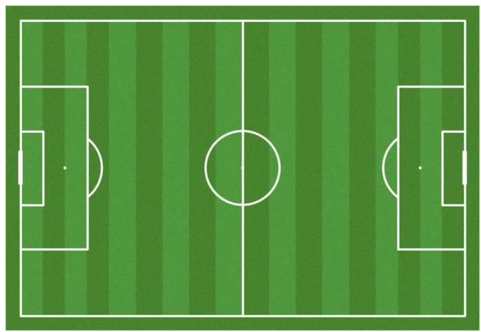
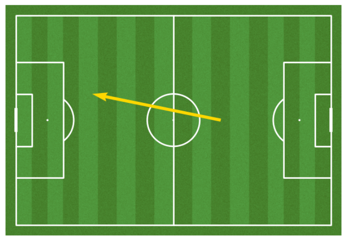
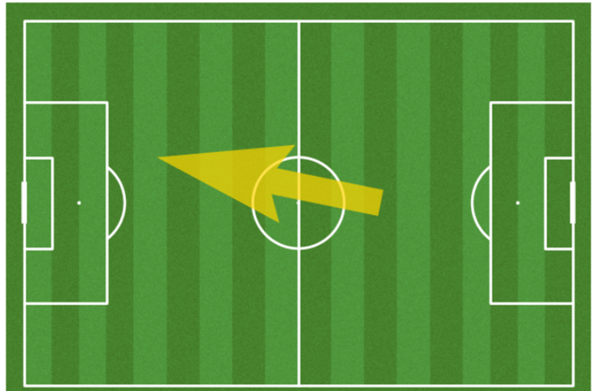

# ⚽ Football Data Analysis with `mplsoccer`

A football pitch visualization and event data analysis project using Python.  
This project explores how to draw, customize, and annotate football pitches using the `mplsoccer` library, with multiple pitch types such as StatsBomb, Wyscout, Opta, and Metricasports.

---

## 📌 Project Goals

- Practice pitch drawing and layout customization using `mplsoccer`
- Compare different pitch providers (e.g. StatsBomb, Wyscout, Opta)
- Visualize shots and passes on various pitch types
- Understand expected goals (xG) through spatial representation

---

## 🛠️ Tech Stack

---

## 🖼️ Sample Visuals

| Pitch Types | Annotated Pitch | Shot & Pass |
|-------------|------------------|-------------|
|  |  |  |

---

## 🔎 Key Highlights

### ⚽ Pitch Drawing

- `Pitch()`, `VerticalPitch()` for horizontal/vertical pitch orientation
- `pitch_color`, `line_color`, `stripe` options for background styling
- `draw()` method with axis and labels toggle

### 🎯 Pitch Size Comparison

- Use different `pitch_type` options: `"statsbomb"`, `"opta"`, `"wyscout"`, `"metricasports"`
- Customize width, length, label visibility, and axis

### 💥 Shot & Pass Visualization

- `scatter()` for player shot location
- `annotate()` to label with player name (e.g. "Son")
- `lines()` and `comet=True` for pass trajectories

